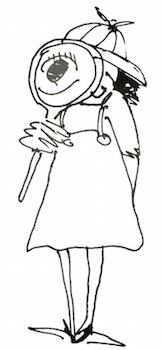
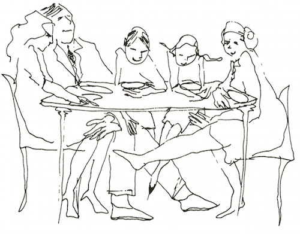
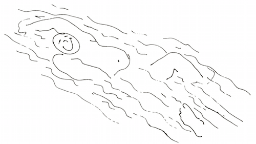

# 1. Introduction

&nbsp;&nbsp;&nbsp;&nbsp;&nbsp;&nbsp;When I was five, I decided that when I grew up I’d be a "children's detective on parents." I didn’t quite know what I would look for, but I realized a lot went on in families that didn’t meet the eye. There were a lot of puzzles I did not know how to understand.

&nbsp;&nbsp;&nbsp;&nbsp;&nbsp;&nbsp;Now many years later, after working with some thousands of families, I find there are still a lot of puzzles. I have learned from my work, and learning opens up new possibilities and new directions for discovery. It is now clear to me that the family is a microcosm of the world. To understand the world, we can study the family: issues such as power, intimacy, autonomy, trust, and communication skills are vital parts underlying how we live in the world. To change the world is to change the family.

&nbsp;&nbsp;&nbsp;&nbsp;&nbsp;&nbsp;Family life is something like an iceberg: most people are aware of only about one-tenth of what is going on — the tenth that they can see and hear. Some suspect these may be more, but they don’t know what and have no idea how to find out. Not knowing can set the family on a dangerous course. Just as a sailor’s fate depends on knowing that the bulk of the iceberg is under the water, so a family’s fate depends on understanding the feelings and needs that lie beneath everyday family events. (What goes on _under_ the table?)

&nbsp;&nbsp;&nbsp;&nbsp;&nbsp;&nbsp;Through the years I have also found ways to approach solutions to many puzzles. I would like to share them with you in this book. In the chapters that follow we will be looking at the underside of the iceberg.

&nbsp;&nbsp;&nbsp;&nbsp;&nbsp;&nbsp;In this age of expanding knowledge about this very small world of elementary particles and this very large world of extragalactic astronomy, we are also learning new things about people’s relationships with people. I believe that historians a thousand years from now will point to our time as the beginning of a new era in the development of humankind, the time when people began to live more comfortably with their humanity.

&nbsp;&nbsp;&nbsp;&nbsp;&nbsp;&nbsp;Over the years I have developed a picture of what human beings living humanly are like. They are people who understand, value, and develop their bodies, finding them beautiful and useful. They are real and honest to and about themselves and others; they are loving and kind to themselves and others. People living humanly are willing to take risks, to be creative, to manifest competence, and to change when the situation calls for it. They find ways to accommodate what is new and different, keeping that part of the old that is still useful and discarding what is not.

&nbsp;&nbsp;&nbsp;&nbsp;&nbsp;&nbsp;When you add all this up, you have physically healthy, mentally alert, feeling, loving, playful, authentic, creative, productive, responsible human beings. These are people who can stand on their own two feet, love deeply, and fight fairly and effectively. They can be on equally god terms with both their tenderness and their toughness, and can know the difference between them.

&nbsp;&nbsp;&nbsp;&nbsp;&nbsp;&nbsp;The family is the context in which a person with such dimensions developers. And the adults in charge are the _peoplemakers_.

&nbsp;&nbsp;&nbsp;&nbsp;&nbsp;&nbsp;In my years as a family therapist, I have found that four aspects of family life keep popping up:

The feelings and ideas one has about oneself, which I call _self-worth_

The ways people use to work out meaning with one another, which I call _communication_

The rules people use for how they should feel and act, which eventually develop into what I call the _family system_

The way people relate to other people and institutions outside the family, which I call the link to _society_.

&nbsp;&nbsp;&nbsp;&nbsp;&nbsp;&nbsp;No matter what kind of problem first led a family into my office — whether an unfaithful wife or depressed husband, a delinquent daughter or a schizophrenic son — I soon found that the prescription was the same. To relieve their family pain, some way had to be found to change these four key factors. In all the troubled families I noticed that:

Self-worth was low.

Communication was indirect, vague, and not really honest.

Rules were rigid, inhuman, nonnegotiable, and everlasting.

The family’s link to society was fearful, placating, and blaming.

&nbsp;&nbsp;&nbsp;&nbsp;&nbsp;&nbsp;I have had the joy of knowing relatively untroubled families, especially in my workshops were families develop their nurturing potential. In these vital and nurturing families, I consistently see a different pattern:

Self-worth is high.

Communication is direct, clear, specific, and honest.

Rules are flexible, human, appropriate, and subject to change.

The link to society is open and hopeful, and is based on choice.

&nbsp;&nbsp;&nbsp;&nbsp;&nbsp;&nbsp;The changes all rest on new learnings, new awareness and a new consciousness. Everyone can achieve these.

&nbsp;&nbsp;&nbsp;&nbsp;&nbsp;&nbsp;No matter where a surgeon studies medicine, he can operate on any human being anywhere in the world, because the internal organs and the limbs will be in relatively the same place. Through my work with families, troubled and nurturing, in most of the continents of the world, I have learned that families everywhere deal with the same issues. In all families.

_Every person has a feeling of worth, positive or negative;_ the question is,

&nbsp;&nbsp;&nbsp;&nbsp;&nbsp;&nbsp;Which is it?

_Every person communicates;_ the question is,

&nbsp;&nbsp;&nbsp;&nbsp;&nbsp;&nbsp;How, and what happens as a result?

_Every person follows rules;_ the question is,

&nbsp;&nbsp;&nbsp;&nbsp;&nbsp;&nbsp;What kind, and how well do they work for her, or him?

_Every person is linked to society;_ the question is,

&nbsp;&nbsp;&nbsp;&nbsp;&nbsp;&nbsp;In what way, and what are the results?

&nbsp;&nbsp;&nbsp;&nbsp;&nbsp;&nbsp;These things are true whether the family is a natural one, in which the man and woman who sired and conceived the child continue to care for that child until the child is grown; a _one-parent_ family, in which one parent leaves the family by death, divorce, or desertion, and all of the parenting is done by the remaining parent; a _blended_ family, whose children are parented by step-, adoptive, foster, or gay parents; or an _institutional_ family, in which groups of adults rear groups of children, as in institutions, communes, or extended families. Today, children are being brought up in many configurations.

&nbsp;&nbsp;&nbsp;&nbsp;&nbsp;&nbsp;Each of these family forms has its own special problems and possibilities, and we will return to them later. Basically, the same forces will be at work in all of them: _self-worth_, _communication_, _rules_ and _links to society_.

&nbsp;&nbsp;&nbsp;&nbsp;&nbsp;&nbsp;This book will help you discover how these elements operate in your own family and point to some new directions you can take to change. Think of my words as the voice of someone who has accumulated experience from sharing the happiness and sorrow, the hurt and anger, and the love, of many families, including my own.

&nbsp;&nbsp;&nbsp;&nbsp;&nbsp;&nbsp;This book is not about blaming parents. People are always doing the best they can. Developing a family is the hardest, most complicated job in the world. The very fact that you are reading this tells me that you care about yourself and the well-being of your family. I hope we can discover a better life together as a family — that we can really experience seeing the lights come on in each other’s eyes when we meet.

&nbsp;&nbsp;&nbsp;&nbsp;&nbsp;&nbsp;Relationships are the living links that join family members. Through exploring the many parts of these relationships, you can come to an understanding of the system in which you now live and create new vitality and joy of teamwork with one another.

&nbsp;&nbsp;&nbsp;&nbsp;&nbsp;&nbsp;From time to time, as you read, you will come upon suggested experiments or exercises designed to give you new experiences and new ways to understand what may be happening to you. I hope you will do each one as you come to it, even if at first it seems simple or foolish. Knowing something begins a change; experiencing makes it happen. These experiments are positive, concrete steps your family can take to become less troubled and more nurturing. The more members of your family who take part, the more effective the results will be. Remember, you learn to swim better when you get into the water.

&nbsp;&nbsp;&nbsp;&nbsp;&nbsp;&nbsp;If you feel shy or doubtful about inviting family members to participate in these exercises with you, become throughly familiar with what you are asking, feel it from your heart, and present your wish simply and directly. If you feel enthusiastic and hopeful about what you are asking, you will probably communicate a sense of excitement, which will make the invitation attractive and encourage your family to go along with you. By setting your request in a simple, straightforward question — "Will you participate with me in an experiment that I think might be useful to us?" — you maximize the opportunity for a positive response.

&nbsp;&nbsp;&nbsp;&nbsp;&nbsp;&nbsp;Badgering, demanding, or nagging people to go along turns the transaction into a power struggle, which usually works in the opposite direction from what one is trying to accomplish. Things may be so ruptured at this point that nothing can be done. However, chances are good that if your family members still live under the same roof, they will be willing to at least try if they are approached properly. Have patience and faith.

&nbsp;&nbsp;&nbsp;&nbsp;&nbsp;&nbsp;I have seen much pain in families. Each family has moved me deeply. Through this book I hope to ease that pain in families whom I may never have a chance to meet personally. In doing so, I also hope to present the pain from continuing into the families their children will form. Some human pain is unavoidable, of course. I see two kinds of pain: one is the pain of recognition of problems, and the other is the pain of blame. The first we can't avoid; the second we can. We can direct our effects to change what we can and to work out creative ways to live with what we can't change.

THE SERENITY PRAYER

God grant me the serenity to accept 
the things I cannot change, 
Courage to change the things I can, 
And wisdom to know the difference. 
— <i>Reinhold Niebuhr</i>

&nbsp;&nbsp;&nbsp;&nbsp;&nbsp;&nbsp;Just reading this book may evoke some or both kinds of pain for you because it can bring back memories. After all, facing ourselves and learning how to take some responsibility for ourselves have their painful moments. If you think there may be a better way of living together as a family than the way you are living now, though, you’ll also find this book rewarding.
