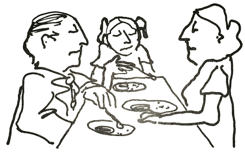
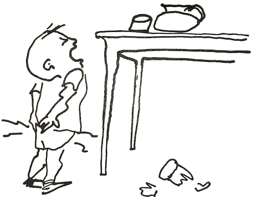
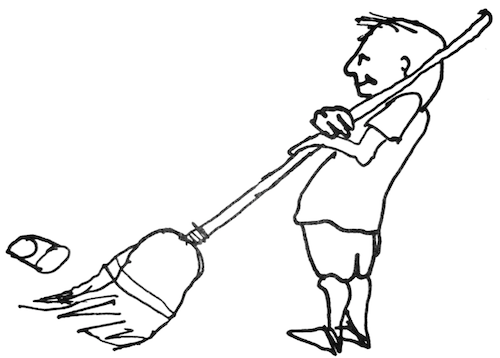
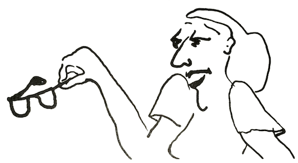

# 2. What's <i>Your</i> Family Like?

_Does it feel good to you to live in your family right now?_ This question seemed not to have occurred to most of the families I have worked with until I posed it. Living together was something they took for granted. If no family crisis was apparent, everyone assumed everyone else was satisfied. Perhaps many family members didn’t dare face such a question. They felt stuck in the family, for better or for worse, and knew no ways to change things.

&nbsp;&nbsp;&nbsp;&nbsp;&nbsp;&nbsp;_Do you feel you are living with friends, people you like and trust, and who like and trust you?_

&nbsp;&nbsp;&nbsp;&nbsp;&nbsp;&nbsp;This question usually brought the same puzzled replies. “Geee, I’ve never thought about that; they’re just my family” — as though family members were somehow different from people!

&nbsp;&nbsp;&nbsp;&nbsp;&nbsp;&nbsp;_Is it fun and exciting to be a member of your family?_

&nbsp;&nbsp;&nbsp;&nbsp;&nbsp;&nbsp;Yes, there really are families whose members find home one of the most interesting and rewarding places they can be. But many people live year after year in families that are a threat, a burden, or a bore.

&nbsp;&nbsp;&nbsp;&nbsp;&nbsp;&nbsp;If you can answer “yes” to these three questions, I am certain you live in what I call a nurturing family. If you answer “no” or “not often,” you probably live in a family that is more or less troubled. This does not mean that you have a bad family. It only means that people aren’t very happy and have not learned way to love and value one another openly.

&nbsp;&nbsp;&nbsp;&nbsp;&nbsp;&nbsp;After knowing hundreds of families, I find that each one can be placed somewhere along a scale from very nurturing to very troubled. I see many similarities in the way nurturing families operate. Troubled families, too, no matter what their problems, seem to have much in common. I would thus like to draw for you a word picture of these two types of families, as I have observed them. Of course, neither picture will fit any specific family exactly, but in one or other you may recognize some part of your own family in action.

&nbsp;&nbsp;&nbsp;&nbsp;&nbsp;&nbsp;The atmosphere in a troubled family is easy to feel. Whenever I am with such family, I quickly sense discomfort. Sometimes it feels cold, as if everyone were frozen; the atmosphere is extremely polite, and everyone is obviously bored. Sometimes it feels as if everything were constantly spinning, like a top; I get dizzy and can’t find my balance. Or it may be an atmosphere of foreboding, like the lull before a storm, when thunder may crash and lightning strike at any moment. Sometimes the air is full of secrecy. Sometimes I feel very sad and cannot find an obvious reason. I realise that’s because the sources are covered up.

&nbsp;&nbsp;&nbsp;&nbsp;&nbsp;&nbsp;When I am in any of these troubled atmospheres, my body reacts violently. My stomach feels queasy; my back and shoulders soon ache, as does my head. I used to wonder if the bodies of these family members responded as mine did. Later, when I knew them better and they became free enough to tell me what life was like in their family, I learned that they did indeed have the same sensations. After having this kind of experience over and over again, I began to understand why so many members of troubled families were beset with physical ills. Their bodies were simply reacting humanly to a very inhuman atmosphere.

&nbsp;&nbsp;&nbsp;&nbsp;&nbsp;&nbsp;Perhaps you will find the reactions I describe here surprising. Everybody — every body — has physical reactions to individuals around him or her. Many people are not aware of it: we were taught as we grew up to turn off these feelings. With years of practice we may turn them off so successfully that we are totally unaware of reacting until, hours later, we have a headache, an aching shoulder, or an upset stomach. Even then we may not understand why. As a therapist I have learned to be tuned in to these feelings in myself and to recognise signs of them in other people. They tell me a good deal about what is actually going on. I hope this book will help you learn to recognize these useful clues in yourself. The first step of change is to recognise what is happening.

&nbsp;&nbsp;&nbsp;&nbsp;&nbsp;&nbsp;In troubled families, people’s bodies and faces tell of their plight. Bodies are either stiff and tight, or slouchy. Faces look sullen, or sad, or blank like masks. Eyes look down and past people. Ears obviously don’t hear. Voices are either harsh and strident, or barely audible.

&nbsp;&nbsp;&nbsp;&nbsp;&nbsp;&nbsp;There is little evidence of friendship among individual family members, little joy in one another. The family seems to stay together through duty, with people just trying to tolerate one another. Now and then I see someone in a troubled family

make and effort at lightness, but the words fall with a thud. More often humour is caustic, sarcastic, even cruel. The adults are so busy telling the child and each other what to do and what not to do that they never get to enjoy themselves as persons. It often comes as a great surprise to members of troubled families that they actually can enjoy one another.

&nbsp;&nbsp;&nbsp;&nbsp;&nbsp;&nbsp;Seeing whole families who were trying to live together in such an atmosphere, I used to wonder how they managed to survive. I discovered that in some families, people simply avoided one another; they became so involved in work and other outside activities that they rarely had much real contact with other family members. It is very easy to live with others in a house and not see them for days.

&nbsp;&nbsp;&nbsp;&nbsp;&nbsp;&nbsp;It is a sad experience for me to be with these families. I see the hopelessness, the helplessness, the loneliness. I see the bravery of people trying to cover up — a bravery that can prematurely kill. Some still cling to a little hope, some still bellow or nag or whine at each other. Others no longer care. These people go on year after year, enduring misery themselves or, in their desperation, inflicting it on others. I could never go on seeing these families unless I had hope they could change, and most of them have. The family can be the place where one finds love and understanding and support, even when all else fails; where we can be refreshed and recharged to cope more effectively with the world outside. But for millions of troubled families, this is merely a dream.

&nbsp;&nbsp;&nbsp;&nbsp;&nbsp;&nbsp;In our urban, industrial society, the institutions we live with have been designed to be practical, efficient, economical, profitable — but rarely to protect and serve the human part of human beings. Nearly everyone experiences either poverty, discrimination, pressure, or other negative consequences of our inhuman social institutions. For people troubled families, who find inhuman conditions at home, too, these difficulties are even harder to bear.

&nbsp;&nbsp;&nbsp;&nbsp;&nbsp;&nbsp;No one would intentionally pick this troubled way of living. Families accept it only because they know of no other way.

&nbsp;&nbsp;&nbsp;&nbsp;&nbsp;&nbsp;_Stop reading for a few minutes and think about some families you know that would fit the description “troubled.” Did the family you grew up in have some of these characteristics: Was your family at times cold, deadening, super polite, secretive, confusing? What are the characteristics of the family you are living in now? Can you discover any signs of trouble that you haven’t been aware of before?_

&nbsp;&nbsp;&nbsp;&nbsp;&nbsp;&nbsp;How different it is to be in a nurturing family! Immediately, I can sense the aliveness, the genuiness, honesty, and love. I feel the heart and soul present as well as the head. People demonstrate their loving, their intellect, and their respect for life.

&nbsp;&nbsp;&nbsp;&nbsp;&nbsp;&nbsp;I feel that if I lived in such a family, I would be listened to and would be interested in listening to others; I would be considered and would wish to consider others. I could openly show my affection as well as my pain and disapproval. I wouldn’t be afraid to take risks because everyone in my family would realise that some mistakes are bound to come with my risk-taking — that my mistakes are a sign that I am growing. I would feel like a person in my own right — noticed, valued, loved, and clearly asked to notice, value, and love others. I would feel free to respond with humour and laughter when it fits.

&nbsp;&nbsp;&nbsp;&nbsp;&nbsp;&nbsp;One can actually see and hear the vitality in such a family. The bodies are graceful, the facial expressions relaxed. People look at one another, not through one another or at the floor; and they speak in rich, clear voices. A flow and harmony permeate their relations with one another. The children, even as infants, seem open and friendly, and the rest of the family treats them very much as persons.

&nbsp;&nbsp;&nbsp;&nbsp;&nbsp;&nbsp;The houses in which these people live tend to have a lot of light and color. Clearly a place where people live, these homes are planned for their comfort and enjoyment, not as showplaces for the neighbours.

&nbsp;&nbsp;&nbsp;&nbsp;&nbsp;&nbsp;When there is quiet, it is peaceful quiet, not the stillness of fear and caution. When there is noise, it is the sound of meaningful activity, not the thunder of trying to drown out everyone else. Each person seems to know that he or she will have the chance to be heard. If one’s turn doesn’t come now, it is only because there isn’t time — not because one isn’t loved.

&nbsp;&nbsp;&nbsp;&nbsp;&nbsp;&nbsp;People seem comfortable about touching one another and showing their affection, regardless of age. Loving and caring aren’t demonstrated by carrying out the garbage, cooking the meals, or bringing home the paycheque. Instead, people show their loving and caring by talking openly and listening with concern, being straight and real with one another, and simply being together.

&nbsp;&nbsp;&nbsp;&nbsp;&nbsp;&nbsp;Members of a nurturing family feel free to tell each other how they feel. Anything can be talked about — the disappointments, fears, hurts, angers, criticisms, as well as the joys and achievements. If Father happens to be bad-humored for some reason, his child can say frankly, “Gee, Dad, you’re grouchy tonight.” The child isn’t afraid that Father will bark back, “How dare you talk to your father that way!” Instead, Father can be frank, too: "I sure am grouchy. I had a terrible day today!"

&nbsp;&nbsp;&nbsp;&nbsp;&nbsp;&nbsp;Nurturing families can make plans. If something interferes with the plan, they can readily make adjustments, often with a sense of humor. This way they are able to handle more of life's problems without panicking. Suppose, for example, that a child drops and breaks a glass. In a troubled family, this accident could lead to a half-hour lecture, a spanking, and perhaps sending the child away in tears. In a

nurturing family, more likely someone would remark, "Well, Johnny, you broke your glass. Did you cut yourself? I'll get you a Band-Aid, and then you can get a broom and sweep up the pieces. I'll get you another glass." If the parent had noticed that Johnny had been holding the glass precariously, he might add, "I think the glass dropped because you didn't have both hands around it." Thus the incident would be used as a learning opportunity (which raises the child’s self-worth) rather than as a cause for punishment, which puts that self-worth in question. In the nurturing family it is easy to pick up the message that human life and human feelings are more important than anything else.

&nbsp;&nbsp;&nbsp;&nbsp;&nbsp;&nbsp;These parents see themselves as empowering leaders, not as authoritative bosses. They see their job primarily as one of teaching their children how to be truly human in all situations. They readily acknowledge to the child their poor judgment as well as their good judgment; their hurt, anger, or disappointment as well as their joy. The behavior of these parents matches what they say. How different from the troubled parent who tells the children not to hurt each other, but slaps them whenever displeased.

&nbsp;&nbsp;&nbsp;&nbsp;&nbsp;&nbsp;Parents are people; they are not automatically leaders the day their first child is born. They learn that good leaders are careful of their timing: they watch for an opportunity to talk to their children when they can really be heard. When a child has misbehaved, the father or mother moves physically close to offer support. This helps the offending child overcome fear and guilt feelings and make the best of the teaching the parent is about to offer.

&nbsp;&nbsp;&nbsp;&nbsp;&nbsp;&nbsp;Recently, I saw a mother in a nurturing family handle a troublesome situation very skillfully and humanly. When she noticed that her two sons, ages five and six, were fighting, she calmly separated the boys, took each by the hand, and sat down with one son on either side of her. Still holding their hands, she asked each of them to tell her what was going on; she listened to one and then the other intently. By asking questions she slowly pieced together what had happened: the five-year-old had taken a dime from the six-year-old's dresser. As the two boys talked about their hurts and feelings of injustice, she helped them make new contact with one another, return the dime to its rightful owner, and pave the way for better ways of dealing with each other. Furthermore, the boys had a good lesson in constructive problem-solving.

&nbsp;&nbsp;&nbsp;&nbsp;&nbsp;&nbsp;Parents in nurturing families know that their children are not intentionally bad. If someone behaves destructively, parents realize some misunderstanding has arisen or someone's self-esteem is dangerously low. They know people learn only when valuing themselves and feeling valued, so they don't respond to behavior in a way that will make people feel devalued. Even when it is possible to change behavior by shaming or punishing, the resulting scar is not easily or quickly healed.

&nbsp;&nbsp;&nbsp;&nbsp;&nbsp;&nbsp;When a child must be corrected, as all children must at one time or another, nurturing parents rely on being clear: asking for information, listening, touching, understanding, using careful timing, and being aware of the child’s feelings and natural wishes to learn and to please. These things all help us to be effective teachers. Children learn from the modeling of direct behavior.

&nbsp;&nbsp;&nbsp;&nbsp;&nbsp;&nbsp;Rearing a family is probably the most difficult job in the world. It resembles two business firms merging their respective resources to make and single product. All the potential headaches of that operation are present when an adult male and an adult female join to steer a child from infancy to adulthood. Parents in a nurturing family realize problems come along, simply because life offers them, and they will be alert to creative solutions as each new problem appears. Troubled families, on the other hand, put all their energies into the hopeless attempt to keep problems from happening; when they do happen — and, of course, they always do — these people have no resources left for solving the crisis.

&nbsp;&nbsp;&nbsp;&nbsp;&nbsp;&nbsp;Nurturing parents realize change is inevitable: children change quickly from one stage to another, nurturing adults never stop growing and changing, and the world around us never stands still. They accept change as part of being alive and try to use it creatively to make their families still more nurturing.

_Can you think of a family that you would call nurturing at least part of the time? Can you remember a time recently when your family could be described as nurturing? Try to remember how it felt to be in your family then. Do these times happen often?_

&nbsp;&nbsp;&nbsp;&nbsp;&nbsp;&nbsp;Some people may scoff at my picture of the nurturing family and say it isn't possible for any family to live that way. Unfulfilling family living is so habitual that it's easy to think there's no other way. To these people I would say, I have had the good fortune to know many nurturing families intimately, and it is possible. The human heart is always seeking love.

&nbsp;&nbsp;&nbsp;&nbsp;&nbsp;&nbsp;Some may protest that there just isn't time to overhaul their family lives. To them I would say, their survival may depend on it. Troubled families make troubled people and thus contribute to the devaluing of self, which is linked to crime, mental illness, alcoholism, drug abuse, poverty, alienated youth, terrorism, and many other social problems. Giving ourselves full permission to make the family a place to develop people who are more truly human will reflect itself in a safer and more humanly responsive world. We can make the family a real place for developing real people. Each of us is a discovery, and each of us makes a difference.

&nbsp;&nbsp;&nbsp;&nbsp;&nbsp;&nbsp;Everyone who holds a position of power or influence in the world was once an infant. How he or she uses power of influence depends largely on what that person learned in the family while growing up. When we help troubled families become nurturing — and nurturing ones become even more nurturing — each person's increased humanity will filter out into government, schools, businesses, religions, and all the other institutions that contribute to the quality of our lives.

&nbsp;&nbsp;&nbsp;&nbsp;&nbsp;&nbsp;I am convinced that any troubled family can become a nurturing one. Most of the things that cause families to be troubled are learned after birth. Since they are learned, they can be unlearned, and new things can be learned in their place. The question is, how?

&nbsp;&nbsp;&nbsp;&nbsp;&nbsp;&nbsp;First, you need to recognize that your family sometimes _is_ a troubled family.

&nbsp;&nbsp;&nbsp;&nbsp;&nbsp;&nbsp;Second, you need to forgive yourself for past mistakes and give yourself permission to change, knowing that things can be different.

&nbsp;&nbsp;&nbsp;&nbsp;&nbsp;&nbsp;Third, make a decision to change things.

&nbsp;&nbsp;&nbsp;&nbsp;&nbsp;&nbsp;Fourth, take some action to start the process of change.

&nbsp;&nbsp;&nbsp;&nbsp;&nbsp;&nbsp;As you begin to see the troubles in your family more clearly, it will help you to realize that whatever may have happened in the past represented the best you knew how to do at the time. There is no reason for anyone to go on feeling guilty or blaming others in the family. Chances are that the causes of your family pain have been invisible to all of you — not because you don't want to see them but because either you don't know where to look or you have been taught to view life through mental glasses that keep you from seeing.

&nbsp;&nbsp;&nbsp;&nbsp;&nbsp;&nbsp;In this book you will begin to take off those glasses and look directly at the things that cause joy or pain in family life. The first is self-worth.

