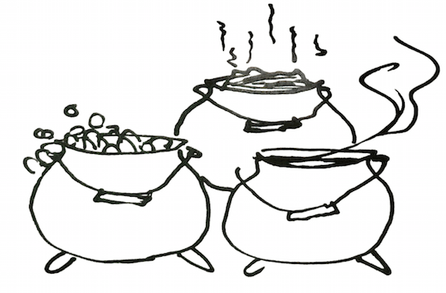
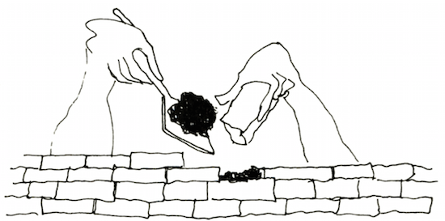
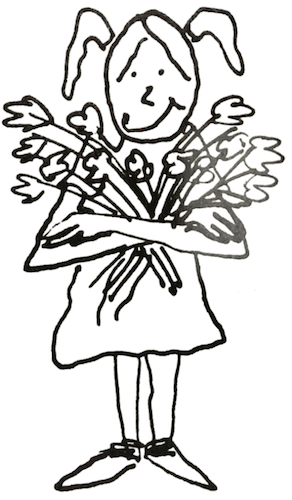

# 3. Self-Worth: The Pot Nobody Watches

Self-esteem is a concept, an attitude, a feeling, an image; and it is represented by behavior.

&nbsp;&nbsp;&nbsp;&nbsp;&nbsp;&nbsp;When I was a little girl, I lived on a farm in Wisconsin. On our back porch was a huge black iron pot, which had lovely rounded sides and stood on three legs. My mother made her own soap, so for part of the year the pot was filled with soap. When threshing crews came through in the summer, we filled the pot with stew. At other times, my father used it to store manure for my mother's flower beds. We came to call it the "3-S pot." Anyone who wanted to use the pot faced two questions: What is the pot now full of, and how full is it?

&nbsp;&nbsp;&nbsp;&nbsp;&nbsp;&nbsp;Long afterward, when people told me about themselves—whether they felt full, empty, dirty, or even "cracked"—I thought of that old pot. One day many years ago, a family was sitting in my office struggling to find words to tell each other how they felt about themselves. I remembered the black pot and told them the story. Soon the members of the family were talking about their individual "pots," whether they contained feelings of worth or of guilt, shame, or uselessness. They told me later how useful this metaphor was to them.

&nbsp;&nbsp;&nbsp;&nbsp;&nbsp;&nbsp;Before long this simple shorthand word was helping many families express feelings that had been difficult to talk about before. A father might say, "My pot is high today," and the rest of the family would know that he felt on top of things, full of energy and good spirits, secure in the knowledge that he really mattered. Or ason might say, "I feel low-pot." This told everyone that he felt he did not matter, he felt tired or bored or bruised, not particularly lovable. It might even mean he had always felt he was not good; that he had to take what was handed to him and could not complain.

&nbsp;&nbsp;&nbsp;&nbsp;&nbsp;&nbsp;_Pot_ is a plain word in this use, almost a nonsense word. Many of the words professional people use to talk about self-worth sound sterile and lack life-and-breath images. Families often find it easier to express themselves in pot terms and to understand when other people express themselves this way. They seem suddenly more comfortable, released from our culture's taboo against talking about one's feelings. A wife who might hesitate to tell her husband that she feels inadequate, depressed, or worthless can say frankly, "Don't bother me now—my pot is dragging!"

&nbsp;&nbsp;&nbsp;&nbsp;&nbsp;&nbsp;In this book when I say "pot," I mean _self-worth_ or _self-esteem_; I use these words interchangeably. (If you prefer another playful word that suits you better, use it.) As I said earlier, every person has a feeling of worth, positive or negative. As with my old family pot, the questions are: is my self-worth negative or positive at this point, and how much of it is there?

&nbsp;&nbsp;&nbsp;&nbsp;&nbsp;&nbsp;Self-esteem is the ability to value one's self and to treat oneself with dignity, love, and reality. Anyone who is loved is open to change. Our bodies are no different. In my many years of teaching young children, treating families of all economic and social levels, meeting people from all walks of life—from all the day-to-day experiences of my profession and personal living, I am convinced that the crucial fac- tor in what happens both _inside_ people and _between_ people is one's self-worth, one's pot.

&nbsp;&nbsp;&nbsp;&nbsp;&nbsp;&nbsp;Integrity, honesty, responsibility, compassion, love, and competence—all flow easily from people whose self-esteem is high. We feel that we matter, that the world is a better place because we are here. We have faith in our own competence. We are able to ask others for help, yet we believe we can make our own decisions and are, in the end, our own best resources. Appreciating our own worth, we are ready to see and respect the worth of others. We radiate trust and hope. We don't have rules against anything we feel. We also know that we don't have to act on everything we feel. We can choose. Our intelligence directs our actions. We accept all of ourselves as human.

&nbsp;&nbsp;&nbsp;&nbsp;&nbsp;&nbsp;Vital people feel high-pot most of the time. True, all of us experience times when we would just as soon chuck it all, when fatigue overwhelms us and the world has dealt out too many disappointments too quickly, when the problems of life suddenly seem more than we can manage. But vital people treat these temporary low-pot feelings as just what they are: a crisis of the moment. This crisis might well be the birth pains of some new possibility for us. We may feel uncomfortable at the time but do not have to hide. We know we can emerge from this crisis whole.

&nbsp;&nbsp;&nbsp;&nbsp;&nbsp;&nbsp;When people feel they have little worth, they expect to be cheated, stepped on, and depreciated by others. This opens the way to becoming a victim. Expecting the worst, these people invite it and usually get it. To defend themselves, they hide behind a wall of distrust and sink into the terrible feeling of loneliness and isolation. Thus separated

from other people, they become apathetic, indifferent to- ward themselves and those around them. It is hard for them to see, hear, or think clearly, and therefore they tend to step on and depreciate others. People who feel this way build huge psychological walls behind which they hide, and then defend themselves by denying they are doing this.

&nbsp;&nbsp;&nbsp;&nbsp;&nbsp;&nbsp;Fear is a natural consequence of this distrust and isolation. Fear constricts and blinds us; it keeps us from risking new ways of solving our problems. Instead, we turn to still more self-defeating behavior. (Fear, incidentally, is always fear of some _future_ thing. I have observed that as soon as a person confronts or challenges whatever she or he is afraid of in the present, the fear vanishes.)

&nbsp;&nbsp;&nbsp;&nbsp;&nbsp;&nbsp;When persons with constant low-pot feelings experience defeat, they often label themselves as failures. " I must be worthless or all these terrible things would not be happening to me" is often the inside response. After enough of these reactions, the self is vulnerable to drugs, alcohol, or other flights from coping.

&nbsp;&nbsp;&nbsp;&nbsp;&nbsp;&nbsp;Feeling low is not the sameas low pot. Low pot essentially means that when you experience undesirable feelings, you try to behave as though those feelings did not exist. It takes a lot of high self-worth to acknowledge your low feelings.

&nbsp;&nbsp;&nbsp;&nbsp;&nbsp;&nbsp;It is also important to remember that persons of high self-esteem can feel low. The difference is that people who are feeling low don't label themselves as worthless or pretend that their low feelings do not exist. Nor do they project their feeling on someone else. Feeling low is quite natural from time to time. It makes a big difference whether one condemns one's self or sees this low time as a human condition with which one needs to cope. I shall be frequently calling your attention to this process of coping.

&nbsp;&nbsp;&nbsp;&nbsp;&nbsp;&nbsp;Feeling low and not admitting it is a form of lying to yourself and others. Devaluing your feelings this way is a direct link to devaluing yourself, thus deepening the conditions of low pot. Much of what happens to us is the outcome of our attitude. Since it is attitude, we can change it.

&nbsp;&nbsp;&nbsp;&nbsp;&nbsp;&nbsp;_Relax for a moment now. Close your eyes and feel your condition now. How are you feeling about yourself? What has happened or is happening at the moment? How are you responding to what is happening? How are you feeling about how you are responding? If you are feeling tight, give yourself a message of love, physically relax yourself and consciously be in touch with your breathing. Now open your eyes.You will feel stronger as a result._

&nbsp;&nbsp;&nbsp;&nbsp;&nbsp;&nbsp;This simple remedy will help build your sense of worth: in moments you can change your state of feeling. You then meet any event with a clearer mind and a firmer personal foundation.

&nbsp;&nbsp;&nbsp;&nbsp;&nbsp;&nbsp;_Invite your family members to try the following experiment with you. Take a partner, then tell one another your feelings ("Right now, I feel scared/tight/embarrassed/happy/etc."). Each partner simply thanks the other without judging or commenting_. You thus hear one another's feelings so you can know each other better. We need a lot of practice to break the taboo against sharing our feelings. _Practice as much as you can with people you trust._

&nbsp;&nbsp;&nbsp;&nbsp;&nbsp;&nbsp;_Now, tell each other what makes you each feel low, or high. You may find new dimensions to the people you have been living with all these years and feel closer or more real to them as a result. When you have finished the exercise, give yourself permission to share what happened for you._

&nbsp;&nbsp;&nbsp;&nbsp;&nbsp;&nbsp;An infant coming into the world has no past, no experience in handling itself, no scale on which to judge his or her own worth. The baby must rely on experiences with people and their messages about his or her worth as a person. For the first five or six years, the child's self-esteem is formed almost exclusively by the family. After the child starts school, other influences come into play; the family remains important. Outside forces tend to reinforce the feelings of worth or worthlessness the child learned at home: the confident youngster can weather many failures, in school or among peers; the child of low self-regard can experience many successes yet feel a gnawing doubt about his or her own value. Even one negative experience can have effects out of all proportion to the event.

&nbsp;&nbsp;&nbsp;&nbsp;&nbsp;&nbsp;Every word, facial expression, gesture, or action on the part of a parent gives the child some message about self-worth. It is sad that so many parents don't realize what messages they are sending. A mother may accept the bouquet clutched in her three-year-old's hand and say, "Where did you pick these?"—with her voice and smile implying, "How sweet of you to bring me these! Where do such lovely flowers grow?" This message would strengthen the

&nbsp;&nbsp;&nbsp;&nbsp;&nbsp;&nbsp;feeling of worth. Or she might say, "How pretty!" but add in a judgmental voice, "Did you pick these in Mrs. Randall's garden?", implying that the child was bad to steal them. This message would make the three-year-old feel wicked and worthless.

&nbsp;&nbsp;&nbsp;&nbsp;&nbsp;&nbsp;What kind of self-worth is your family building in the children and reinforcing in the adults? You can begin to D find out with this next experiment.

&nbsp;&nbsp;&nbsp;&nbsp;&nbsp;&nbsp;_Tonight, when the family has settled around the table for dinner, notice what is happening to your feelings about yourself when other members speak to you. There will be some remarks to which you have no special response. However, you may be surprised to find that even "Pass the potatoes, please" can give you a feeling of or depreciation, depending on the speaker's tone of voice, facial expression, timing (did the message interrupt you, or ignore something you said?), and how good you are feeling about yourself. If you are feeling good about yourself, you may find that you have a lot of options for how you respond. If you are feeling low, however, you might find that your options are limited (see chapter 6 on communication)._

&nbsp;&nbsp;&nbsp;&nbsp;&nbsp;&nbsp;_Halfway through dinner, change the perspective. Listen to what you are saying to others. Try to be in the other's shoes and imagine how you might feel if you were talked to as you are doing now. Would you, for instance, feel loved and valued?_

&nbsp;&nbsp;&nbsp;&nbsp;&nbsp;&nbsp;_Tomorrow night explain this little game to the other members of the family and invite them to join you. It will be helpful to read this chapter aloud before you do this as a family. After dinner, talk together about what you discovered and how you felt._

&nbsp;&nbsp;&nbsp;&nbsp;&nbsp;&nbsp;Feelings of worth can flourish only in an atmosphere in which individual differences are appreciated, love is shown openly, mistakes are used for learning, communication is open, rules are flexible, responsibility (matching promise with delivery) is modeled and honesty is practiced—the kind of atmosphere found in a nurturing family. It is no accident that the children of families who practice the above usually feel good about themselves and consequently are loving, physically healthy, and competent.

&nbsp;&nbsp;&nbsp;&nbsp;&nbsp;&nbsp;Conversely, children in troubled families often feel worthless, growing up as they must amid "crooked" communication, inflexible rules, criticism of their different- ness, punishment for their mistakes, and no experience in learning responsibility. Such children are highly at risk of developing destructive behavior toward themselves and/or others. Much of an individual's potential is held in abeyance when this happens. I f this has happened to you, I hope you are now taking steps to free that energy. The basic tools and directions for doing so are contained throughout this book, especially in the chapters on communication and self-esteem.

&nbsp;&nbsp;&nbsp;&nbsp;&nbsp;&nbsp;These same differences in self-worth can be seen in adult family members. It is not so much that the family affects the adult's sense of self (although that certainly happens) as that parents with high self-esteem are more likely to create nurturing families, and low-self-worth parents to produce troubled families. The system evolves out of the architects of the family: the parents.

&nbsp;&nbsp;&nbsp;&nbsp;&nbsp;&nbsp;After years of working with families, I find that I can no longer blame parents, no matter how foolish or destructive their actions may be. I do hold parents responsible for accepting the consequences of their acts and learning to do differently. This is a good first step to improving the whole family situation.

&nbsp;&nbsp;&nbsp;&nbsp;&nbsp;&nbsp;Happily, it is possible to raise anyone's self-esteem, no matter what one's age or condition. Since the feeling of low worth has been learned, it can be unlearned, and something new learned in its place. The possibility for this learning lasts from birth to death, so it is never too late. A t any point in a person's life, she or he can begin to learn higher self-worth.

&nbsp;&nbsp;&nbsp;&nbsp;&nbsp;&nbsp;I mean this to be the most important message in this book: _there is always hope that your life can change, because you can always learn new things_. Human beings can grow and change all their lives. It is a little harder as we grow older, and sometimes takes a little longer. It all depends on how set we choose to be in our ways. Knowing that change is possible and committing oneself to changing are first big steps. Some of us may be slow learners, but we are all educable.

&nbsp;&nbsp;&nbsp;&nbsp;&nbsp;&nbsp;This bit of prose contains my feelings and ideas about self-worth.*

My Declaration of Self-Esteem

&nbsp;&nbsp;&nbsp;&nbsp;&nbsp;&nbsp;I am me.

&nbsp;&nbsp;&nbsp;&nbsp;&nbsp;&nbsp;In all the world, there is no one else exactly like me. There are persons who have some parts like me, but no one adds up exactly like me. Therefore, everything that comes out of me is authentically mine because I alone chose it.

&nbsp;&nbsp;&nbsp;&nbsp;&nbsp;&nbsp;I own everything about me: my body, including everything it does; my mind, including all its thoughts and ideas: my eyes, including the images of all they behold; my feelings, whatever they may be: anger, joy, frustration, love, disappointment, excitement; my mouth, and all the words that come out of it: polite, sweet or rough, correct or incorrect; my voice, loud or soft; and all my actions, whether they be to others or to myself.

&nbsp;&nbsp;&nbsp;&nbsp;&nbsp;&nbsp;I own my fantasies, my dreams, my hopes, my fears.

&nbsp;&nbsp;&nbsp;&nbsp;&nbsp;&nbsp;I own all my triumphs and successes, all my failures and mistakes.

&nbsp;&nbsp;&nbsp;&nbsp;&nbsp;&nbsp;Because I own all of me, I can become intimately acquainted with me. By so doing, I can love me and be friendly with me in all my parts. I can then make it possible for all of me to work in my best interests.

&nbsp;&nbsp;&nbsp;&nbsp;&nbsp;&nbsp;I know there are aspects about myself that puzzle me, and other aspects that I do not know. But as long as I am friendly and loving to myself, I can courageously and hopefully look for the solutions to the puzzles and for ways to find out more about me.

&nbsp;&nbsp;&nbsp;&nbsp;&nbsp;&nbsp;However I look and sound, whatever I say and do, and whatever I think and feel at a given moment in time is me. This is authentic and represents where I am at that moment in time.

&nbsp;&nbsp;&nbsp;&nbsp;&nbsp;&nbsp;When I review later how I looked and sounded, what I said and did, and how I thought and felt, some parts may turn out to be unfitting. I can discard that which is unfitting, and keep that which proved fitting, and invent something new for that which I discarded.

&nbsp;&nbsp;&nbsp;&nbsp;&nbsp;&nbsp;I can see, hear, feel, think, say, and do. I have the tools to survive, to be close to others, to be productive, and to make sense and order out of the world of people and things outside of me.

&nbsp;&nbsp;&nbsp;&nbsp;&nbsp;&nbsp;I own me, and therefore, I can engineer me.

&nbsp;&nbsp;&nbsp;&nbsp;&nbsp;&nbsp;I am me and I am okay.

*Reprinted by permission of (and available in poster form from) Celestial Arts. The poster is called "I Am Me".

